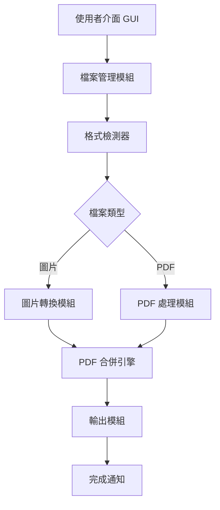

# MergePDF - 多格式檔案合併為 PDF 工具

## 專案概述

**專案名稱**: MergePDF  
**目標平台**: Windows  
**開發語言**: Python 3.x  
**專案類型**: 桌面應用程式

### 核心目標
開發一個 Windows 桌面工具，能夠將多種常見檔案格式（JPG、PNG、PDF）合併成單一 PDF 檔案。

## 功能需求

### 支援的檔案格式
✅ **圖片格式**
- JPG / JPEG
- PNG

✅ **文件格式**
- PDF

❌ **不需支援的格式**
- Word (.doc, .docx)
- Excel (.xls, .xlsx)
- PowerPoint (.ppt, .pptx)

> [!NOTE]
> Word、Excel 等 Office 檔案已有內建的「列印為 PDF」功能，使用者可先自行轉換為 PDF 後再使用本工具合併。

### 核心功能

1. **檔案選擇**
   - 支援多選檔案
   - 支援拖放（Drag & Drop）操作
   - 自動識別支援的檔案格式

2. **檔案排序**
   - 顯示已選檔案列表
   - 支援拖曳調整順序
   - 支援上移/下移按鈕調整順序
   - 支援刪除已選檔案

3. **格式轉換與合併**
   - JPG/PNG 自動轉換為 PDF 頁面
   - 保持原始圖片比例
   - 按照使用者指定順序合併所有檔案
   - 混合格式無縫合併（圖片 + PDF）

4. **輸出設定**
   - 自訂輸出檔案名稱
   - 選擇輸出路徑
   - 合併完成後提示

## 技術規格

### 開發環境
- **語言**: Python 3.8+
- **GUI 框架**: tkinter (Python 內建)
- **打包工具**: PyInstaller

### 核心依賴套件

| 套件名稱 | 版本 | 用途 |
|---------|------|------|
| **Pillow** | 最新穩定版 | 圖片處理與格式轉換 |
| **PyPDF2** | 最新穩定版 | PDF 檔案合併與操作 |
| **img2pdf** | 最新穩定版 | 圖片轉 PDF（保持原始品質） |
| **tkinterdnd2** | 最新穩定版 | 拖放功能支援 (可選) |

### 系統架構



## 使用者介面設計

### 主視窗佈局
```
┌─────────────────────────────────────────┐
│  MergePDF - 檔案合併工具                  │
├─────────────────────────────────────────┤
│  [新增檔案] [清空列表]           [合併] │
├─────────────────────────────────────────┤
│  檔案列表區域                             │
│  ┌─────────────────────────────────────┐ │
│  │ 1. image1.jpg         [↑] [↓] [X] │ │
│  │ 2. document.pdf       [↑] [↓] [X] │ │
│  │ 3. image2.png         [↑] [↓] [X] │ │
│  └─────────────────────────────────────┘ │
│                                          │
│  或將檔案拖放至此處                       │
├─────────────────────────────────────────┤
│  輸出檔名: [merged_output.pdf]  [瀏覽]   │
│  輸出路徑: [C:\Users\...\Desktop] [瀏覽] │
├─────────────────────────────────────────┤
│  狀態: 就緒                   共 3 個檔案 │
└─────────────────────────────────────────┘
```

## 開發計畫

### Phase 1: 核心功能開發 (預計 2-3 天)
- [x] 專案結構規劃
- [ ] 檔案轉換模組
  - [ ] 圖片轉 PDF 功能
  - [ ] PDF 讀取與合併功能
- [ ] 核心合併引擎
- [ ] 基礎測試

### Phase 2: GUI 介面開發 (預計 2-3 天)
- [ ] tkinter 主視窗建立
- [ ] 檔案選擇與列表顯示
- [ ] 順序調整功能
- [ ] 輸出設定介面
- [ ] 錯誤提示與通知

### Phase 3: 功能整合與測試 (預計 1-2 天)
- [ ] 前後端整合
- [ ] 完整功能測試
- [ ] 效能優化
- [ ] 錯誤處理強化

### Phase 4: 打包與部署 (預計 1 天)
- [ ] PyInstaller 配置
- [ ] 打包成獨立 .exe
- [ ] 測試執行檔
- [ ] 使用者文件撰寫

## 品質保證

### 測試案例
1. **單一格式測試**
   - 僅 JPG 圖片合併
   - 僅 PNG 圖片合併
   - 僅 PDF 檔案合併

2. **混合格式測試**
   - JPG + PDF 混合
   - PNG + PDF 混合
   - JPG + PNG + PDF 混合

3. **邊界測試**
   - 大量檔案 (50+ 檔案)
   - 大尺寸圖片 (4K+)
   - 大尺寸 PDF (100+ 頁)

4. **錯誤處理測試**
   - 不支援的檔案格式
   - 損壞的檔案
   - 權限不足的檔案

## 預期成果

### 最終交付物
1. ✅ **獨立執行檔** (`MergePDF.exe`)
   - 無需安裝 Python 環境
   - 雙擊即可執行
   - 檔案大小約 20-30 MB

2. ✅ **原始碼**
   - 完整 Python 專案
   - 清晰的程式碼結構
   - 註解與文件

3. ✅ **使用者說明**
   - README.md
   - 操作指南

## 專案結構

```
MergePDF/
├── main.py                 # 主程式進入點
├── gui/
│   ├── __init__.py
│   ├── main_window.py     # 主視窗
│   └── components.py      # UI 元件
├── core/
│   ├── __init__.py
│   ├── image_converter.py # 圖片轉換
│   ├── pdf_merger.py      # PDF 合併
│   └── file_handler.py    # 檔案處理
├── utils/
│   ├── __init__.py
│   └── validators.py      # 驗證工具
├── requirements.txt       # 依賴清單
├── README.md             # 專案說明
├── plain.md              # 工作清單
└── claude_project.md     # 本文件
```

## 風險評估

| 風險項目 | 影響程度 | 緩解措施 |
|---------|---------|---------|
| 大檔案處理效能 | 中 | 實作進度條、優化記憶體使用 |
| 特殊格式 PDF 相容性 | 低 | 完整測試、錯誤提示 |
| 打包後檔案過大 | 低 | PyInstaller 優化設定 |

## 後續擴展可能性

未來可考慮加入的功能：
- 🔄 支援更多圖片格式 (BMP, TIFF, GIF)
- 📄 PDF 頁面選擇與刪除
- 🔧 進階設定（壓縮比、輸出品質）
- 🌐 批次處理模式
- 💾 記憶上次使用的設定
- 🎨 自訂頁面大小與邊距

---

**狀態**: ✅ 規劃完成，等待使用者審查批准  
**建立日期**: 2025-11-26  
**最後更新**: 2025-11-26
